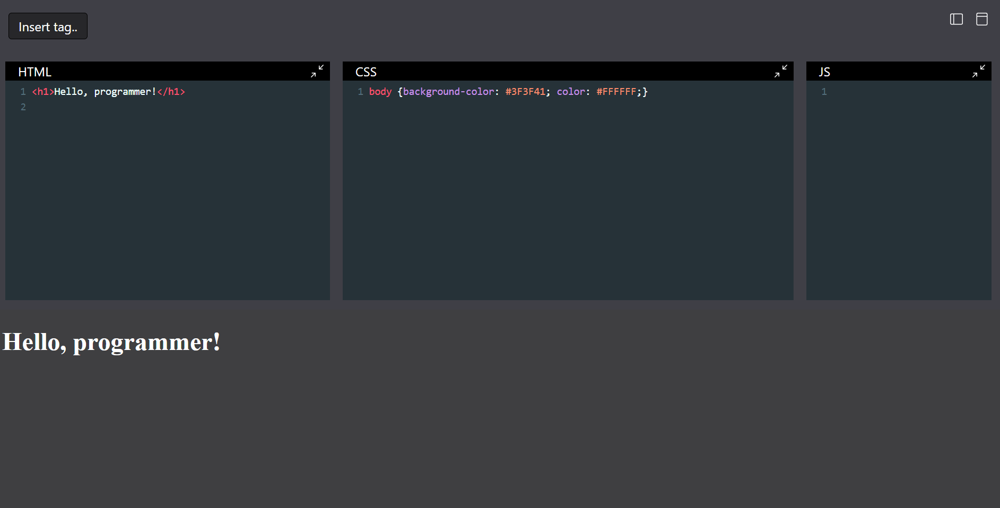
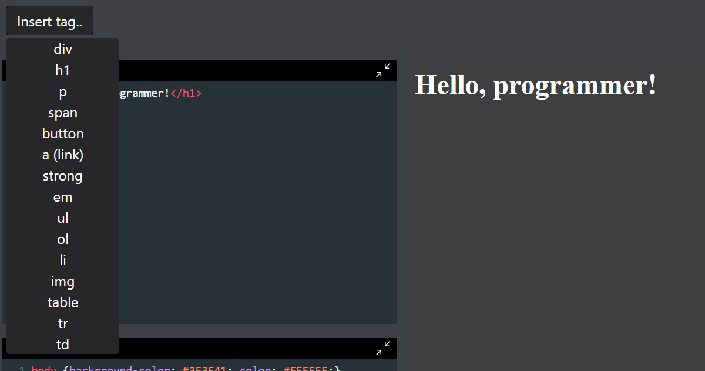
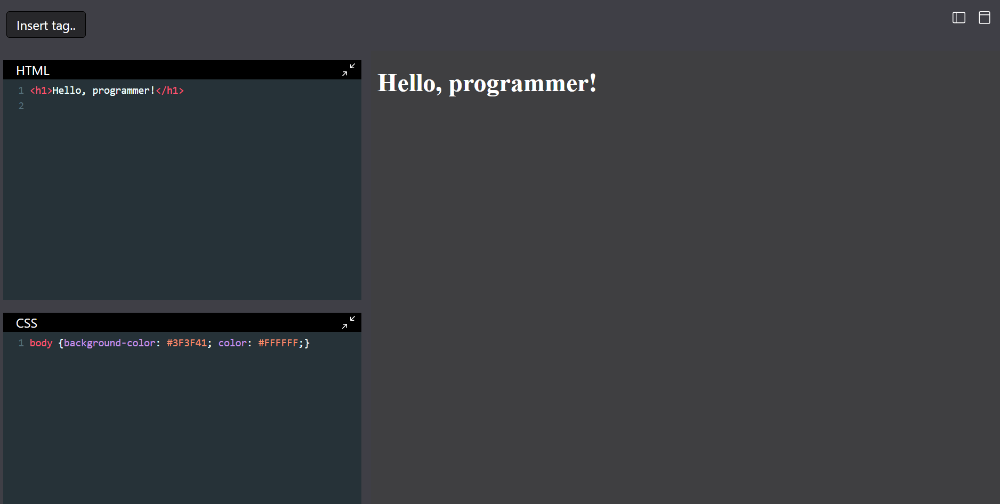

# HTML-CSS-JS COMPILER

## Table of contents

- [Overview](#overview)
  - [About This Project](#about-this-project)
  - [Screenshot](#screenshot)
  - [Links](#links)
- [My process](#my-process)
  - [Built with](#built-with)
  - [What I learned](#what-i-learned)
  - [Continued development](#continued-development)
- [Author](#author)

## Overview

### About This Project

This project provides an interactive platform where users can write and test HTML, CSS, and JavaScript code in real time. The primary goal is to create a seamless experience for experimenting with front-end code, allowing users to instantly see the results of their changes.

Built with React and Tailwind CSS, the application offers a modern and responsive interface. Users can input their code into separate panels for HTML, CSS, and JavaScript, and view the output directly on the same page. This setup is designed to facilitate learning and rapid prototyping.

### Screenshot

### Links

- Live Site URL: [live site URL here](https://your-live-site-url.com)

## My process

### Built with

In this project, I utilized a combination of modern technologies to create an interactive coding environment. The core components include:

- React: A powerful JavaScript library for building user interfaces, which was used to create a dynamic and responsive frontend.

- Tailwind CSS: A utility-first CSS framework that helped design a clean and adaptable layout.

- CodeMirror and react-codemirror2: Libraries used to implement robust code editors for HTML, CSS, and JavaScript. CodeMirror provides a versatile code editor, while react-codemirror2 integrates it seamlessly with React.

- Iframe: Employed to display real-time results of the code entered by the user. Changes made in the code editors are dynamically injected into the iframe to provide immediate feedback.

### What I learned
During the development of this project, I gained valuable experience in integrating code editors with a live preview system. Key takeaways include:

- Managing State: Efficiently handling and synchronizing the state between the code editors and the iframe.

- Responsive Design: Implementing a responsive layout using Tailwind CSS to ensure the application looks great on all devices.
- Real-time Updates: Ensuring that code changes are immediately reflected in the iframe, which involved using React's state management and lifecycle methods.

### Continued development

Future improvements and features for this project may include:

- Live Code Sharing: Allowing users to share code with their friends or colleagues for collaboration

- Enhanced Code Validation: Adding features to validate and provide feedback on code errors or warnings.

- User Authentication: Allowing users to save and manage their code snippets.

- Customization Options: Providing options for users to customize the appearance and functionality of the code editors.

## Author

- Website - [Muhammad Zohaib](https://muhammadzohaib4.wordpress.com/)
- Linkedin - [Muhammad Zohaib](www.linkedin.com/in/muhammad-zohaib-a42923316)